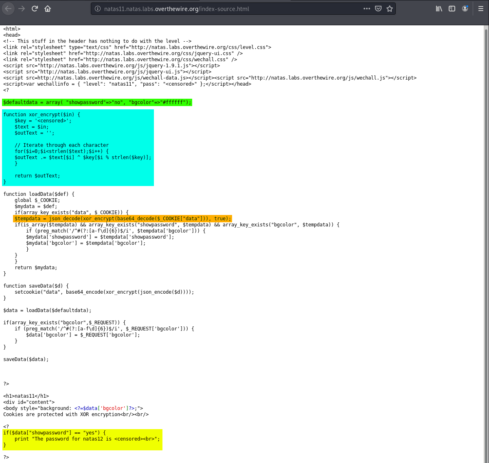

# Natas

## Level 0

Username: natas0<br>
Password: natas0<br>
URL:      http://natas0.natas.labs.overthewire.org

In this level, all you have to do is look into the source code of the web page and you will see the password written as a comment.


The password to progress onto the next level is `gtVrDuiDfck831PqWsLEZy5gyDz1clto`.

## Level 0 → Level 1

Username: natas1<br>
URL:      http://natas1.natas.labs.overthewire.org

In this level, we have to see the web page source code without right-clicking. To do this, we can press `F12` or `CTRL+U`.


The password to progress onto the next level is `ZluruAthQk7Q2MqmDeTiUij2ZvWy2mBi`

## Natas Level 1 → Level 2

Username: natas2<br>
URL:      http://natas2.natas.labs.overthewire.org

In this level, we are given an empty web page. However, upon closer inspection we see that there is an image in the page that is 1x1 pixels in size. 


The more intersting part, is the images source. The image comes from a directory named `files`. Go to this directory, and you'll see a `txt` file named `users.txt`. That file will contain the password to the next level.


The password to progress onto the next level is `sJIJNW6ucpu6HPZ1ZAchaDtwd7oGrD14`

## Natas Level 2 → Level 3

Username: natas3<br>
URL:      http://natas3.natas.labs.overthewire.org

In this level, we look into the source of the web page and see a hint for where the password might be. 


Mentioning that "Google" may not find a certain web page hints at the use of [Robots.txt](https://www.robotstxt.org/). Knowing this, we can go `Robots.txt` and see that one directory has been disallowed. 


Visiting this disallowed directory, we can see a `users.txt` file with the password for the level inside.

The password to progress onto the next level is `Z9tkRkWmpt9Qr7XrR5jWRkgOU901swEZ`

## Natas Level 3 → Level 4

Username: natas4<br>
URL:      http://natas4.natas.labs.overthewire.org

In this level, the web page tells us that we are not authorized to see the page because we are not coming from `http://natas5.natas.labs.overthewire.org/`. To specify this, we can use `curl` and the `--referer` option, along with the credentials for the current level. 


The password to progress onto the next level is `iX6IOfmpN7AYOQGPwtn3fXpbaJVJcHfq`

## Natas Level 4 → Level 5

Username: natas5<br>
URL:      http://natas5.natas.labs.overthewire.org

In this level, the web page tells us that access is disallowed, and that we are not logged in. A common place that indicates whether you as a user are logged in on a website or not, is the browsers cookies. 

If we check the cookies, we see one named `loggedin` with the value of 0. By changing this value to 1, we can get the password. 


The password to progress onto the next level is `aGoY4q2Dc6MgDq4oL4YtoKtyAg9PeHa1`

## Natas Level 5 → Level 6

Username: natas6<br>
URL:      http://natas6.natas.labs.overthewire.org

In this level, we are given an input box where we have to submit a secret key in order to get the password. This web page also conveniently contains the source code of the check that is done on our input. 


Highlighted in yellow is the `if` statement that checks whether we put in the correct input in order to give us the password. This check is done against a variable `$secret`, which we don't know the value of. However, highlighted in green is the line that includes resources from another page. If we go to this page manually and look at the source code, we see the secret key. 


Entering this key into the original input box gives us the password.

The password to progress onto the next level is `7z3hEENjQtflzgnT29q7wAvMNfZdh0i9`

## Natas Level 6 → Level 7

Username: natas7<br>
URL:      http://natas7.natas.labs.overthewire.org

In this challenge, we are given a website with a Home and About page. Going to these different pages, we notice that `php` is used to query our requests. Looking in the source of the web page reveals a hint. 


Knowing the directory of where the password is, as well as the fact that this website is using `php`, we can exploit our `php` query to navigate to the directory given in the hint. 


The password to progress onto the next level is `DBfUBfqQG69KvJvJ1iAbMoIpwSNQ9bWe`

## Natas Level 7 → Level 8

Username: natas8<br>
URL:      http://natas8.natas.labs.overthewire.org

This level is similar to level 6, such that it gives us a text prompt and the source code that checks our input, and matches it to the correct input. 


In the cyan highlighting, we can see the statement that checks our input against a variable `$encodedSecret`. The value of this variable is in the green highlighting, which is `3d3d516343746d4d6d6c315669563362`. This value is derived from the function highlighted in yellow, which we can reverse engineer. 

According to the function, our input is first encoded into base64, reversed, and then converted to hexadecimal from raw binary bytes. What we need to do, is take the value `3d3d516343746d4d6d6c315669563362`, convert it back to raw binary bytes, reverse it, and dase64 decode it. This can all be done in the command line. 

```shell
$ echo -n "3d3d516343746d4d6d6c315669563362" | xxd -r -p | rev | base64 -d
oubWYf2kBq
```

If enter this input into the text box, we get the password.


The password to progress onto the next level is `W0mMhUcRRnG8dcghE4qvk3JA9lGt8nDl`

## Natas Level 8 → Level 9

Username: natas9<br>
URL:      http://natas9.natas.labs.overthewire.org

In this level, we are given a text prompt with the source code once again to PWN it. 


Looking through the source code, we see in the yellow highlighting the `if` statement that checks wether or not we included text in our form submission. If we did, then our input gets put into a variable `$key`. Next, another `if` statement in green highlighting checks if the `$key` variable is empty or not. If it isn't empty, then a shell command is executed. The following shell command uses `grep` to filter out any words in the dictionary that contain our input. 

What's important is that there doesn't seem to be anything that filters our text, so what we can do is inject a `cat` command to show the password for the next level. If we remember level 7, we know that the password for the levels are in `/etc/natas_webpass/`. Thus, we can inject the following string that will print the password for the next level:

```shell
yeet | cat /etc/natas_webpass/natas10
```

`yeet` is just placeholder text, you can add anything there as long as the `cat` command is piped after it.


The password to progress onto the next level is `nOpp1igQAkUzaI1GUUjzn1bFVj7xCNzu`

## Natas Level 9 → Level 10

Username: natas10
URL:      http://natas10.natas.labs.overthewire.org

This level is similar to the previous one. We have a text box that takes our input and uses it in a `grep` command. 


Looking at the source code, we notice that this time there is an `if` statement highlighted in yellow that checks if we have any of the following blacklisted characters: `[;|&]`. This means that we cannot use the same method we used in the previous level. What we can do instead, is exploit `grep` by searching for an empty pattern, which matches any file given. Furthermore, we can supply the password file since `grep` can take multiple files. 

```shell
'' /etc/natas_webpass/natas11
```


The password to progress onto the next level is `U82q5TCMMQ9xuFoI3dYX61s7OZD9JKoK`

## Natas Level 10 → Level 11

Username: natas11
URL:      http://natas11.natas.labs.overthewire.org

In this level, we are once again given a text box that takes input. However, looking at the source code of this challenge, it seems that we have to exploit the cookie, not the input. 



Looking through the code, we notice a few things. 

Highlighted in green is the default data when first visiting the page. It is an array containing two values: `bgcolor` is the hex value of the color we choose, and `showpassword` is the value that will print the password to the next level according to the `if` statement highlighted in yellow. 

This array is stored in the cookie `data` we see when we open up the developer console in our browser on this page. However, its obfuscted using the function highlighted in cyan. We also see that cookie is base64 encoded, as the line highlighted in organge first decodes it before calling the `xor_encrypt` function.

What we'll have to do is get the key using the [XOR Known-plaintext Attack](https://blog.didierstevens.com/2016/01/01/xor-known-plaintext-attack/). To do this, we have to reverse the process of the xor encryption on the cookie value we get when first accessing the web page (make sure to replace the `%3D` at the end with `=`, as its URL encoded). 


Then, copy the `xor_encrypt` function with the `$key` variable being the value of `$defaultdata`. Once we xor the encrypted cookie with the plaintext, we should get the key (keep in mind that the array is also `json` encoded). 

```php
<?php
$cookie = base64_decode("ClVLIh4ASCsCBE8lAxMacFMZV2hdVVotEhhUJQNVAmhSEV4sFxFeaAw=");

function xor_encrypt($in) {
    $key = json_encode(array( "showpassword"=>"no", "bgcolor"=>"#ffffff"));
    $text = $in;
    $outText = '';

    // Iterate through each character
    for($i=0;$i<strlen($text);$i++) {
    $outText .= $text[$i] ^ $key[$i % strlen($key)];
    }

    return $outText;
}

echo xor_encrypt($cookie);

?>
```

Running this php script should give you the key repeating numerous times. 


Now that we know that `qw8J` is the key, we can change our array to have `showpassword` be equal to `yes`, encrypt it, and then set it as our cookie so that the original webpage shows the password. 

To do this, change the value of `$cookie` to be the array with the new value, and change the key to `qw8J`.

```php
<?php
$cookie = json_encode(array( "showpassword"=>"yes", "bgcolor"=>"#ffffff"));

function xor_encrypt($in) {
    $key = "qw8J";
    $text = $in;
    $outText = '';

    // Iterate through each character
    for($i=0;$i<strlen($text);$i++) {
    $outText .= $text[$i] ^ $key[$i % strlen($key)];
    }

    return $outText;
}

echo base64_encode(xor_encrypt($cookie));

?>
```

Running this script should give us our new cookie value. 


Get the value, change it in your browser, refresh the page, and you'll get the password.


The password to progress onto the next level is `EDXp0pS26wLKHZy1rDBPUZk0RKfLGIR3`